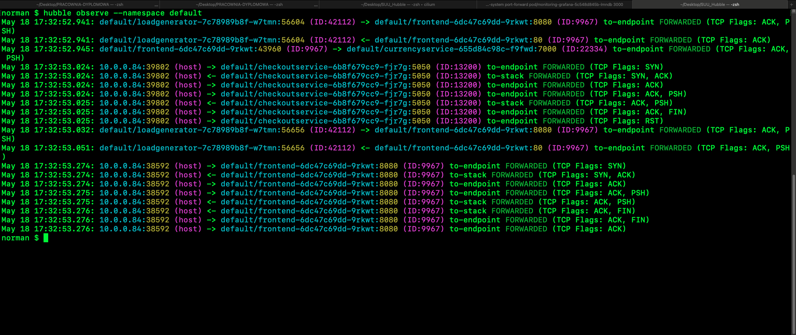

# Hubble - OTel
### Autorzy: Szymon Sadowski, Szymon Mamoń, Szczepan Rzeszutek, Jakub Wojciechowski
### 2025, grupa środa 15:00

## Spis treści
1. [Wprowadzenie](#wprowadzenie)
2. [Teoria](#teoria)
3. [Koncept Demo](#koncept-demo)
4. [Wykorzystane Technologie](#wykorzystane-techonologie)
5. [Konfiguracja środowiska](#konfiguracja-środowiska)
6. 

## Wprowadzenie

## Teoria


### Cilium
Dzięki wykorzystaniu technologii eBPF, eliminuje konieczność używania proxy w klastrach kubernetes. Większość CNI (CNI - z ang. Container Network Interaface, po polsku - Interfejs Sieciowy Kontenera) opiera się na iptables, czyli programu filtrującego pakiety poprzez tabele zawierające łańcuchy reguł stosowane dla pakietów. Iptables jest niestety słabo skalowalny, zwiększając opóźnienia i zmniejszając przepustowość. Dlatego Cilium korzysta z eBPF, co pozwala na lepszą skalowalność. Cilium pozwala również na load balancing na warstwie 4 oraz na tworzenie service/cluster mesha. Cilium implementuje również warstwę observability - Hubble. Cilium składa się z 4 głównych komponentów:
* Cilium operator;
* Cilium agent;
* Cilium CLI;
* Cilium CNI plugin.

Cilium operator zapewnia, że Cilium jest poprawnie skonfigurowany na każdym nodzie klastra. Cilium agent, daemon na każdym nodzie, zarządza programami eBPF, służącymi do kontroli uprawnień sieciowych kontenerów. Cilium CLI pozwala na konfigurację Cilium z terminala. CNI plugin integruje Cilium z kubernetesem, dzięki czemu klaster może wykorzystywać implementowane przez Cilium rozwiązania. Cilium pozwala na zarządzanie pakietami poprzez etykietowanie. Cilium pozwala także zaimplementować zero-trust security ([wso2 case study](https://www.cncf.io/case-studies/wso2/)). 

### eBPF
eBPF (Extended Berkeley Packet Filter) pozwala na wykonywanie kodu w jądrze Linuxa (lub innych systemów operacyjnych). Programy mogą reagować na dowolne wydarzenia w systemie. Pozwala to zbierać dane (observability). Poprzez eBPF można również wpływać na zachowanie jądra, np. przekierowując/modyfikując pakiety. Zmiany te mogą zachodzić dynamicznie.
### Hubble
Observability na warstwie 3, 4 i 7. Pozwala się dowiedzieć: Jakie serwisy się ze sobą komunikują? Jak często? Jakie są między nimi zależności? Jakie HTTP calle są wysyłane? Z których tematów Kafka konsumuje serwis? Do których produkuje? Czy jakaś komunikacja sieciowa zawodzi? Czemu zawodzi? Czy jest to przez DNS? Czy jest to problem z aplikacją, czy z siecią? Na której warstwie jest problem (4 - TCP, czy 7 - HTTP)? Jak często występują kody 4xx lub 5xx HTTP dla któregoś serwisu albo na przestrzeni całego klastra? Jakie jest opóżnienie? Które serwisy mają zablokowaną komunikację (na podstawie zainstalowanych reguł)? Które serwisy mogą komunikować się poza klastrem?

### Open Telemetry
Zestaw narzędzi do observability do zbierania danych takich jak ślady, metryki, logi oraz profile. Może być używany w połączeniu z wieloma innymi narzędziami, takimi, które są open-source (jak np. Jaeger) albo komercyjnymi. Open Telemetry jest wszechstronne, działa dla aplikacji lub systemu, niezależnie w jakim języku programowania jest on napisany, jaką ma infrastrukturę, czy środowisko wykonawcze. Open Telemetry składa się z kilku głównych komponentów:
1. API - konieczne, aby móc korzystać z narzędzia; 
2. SDK - pozwala na szerszą konfigurację, na przykład filtrowanie zapytań, próbkowanie transakcji;
3. In-process exporter - jest częścią SDK. Pozwala skonfigurować, do którego backendu trafią dane telemetrii. Ułatwia zmianę używanego backendu;
4. Collector - Jest wielce użyteczny, ale nie jest koniecznym elementem OTel. Daje większą swobodę w otrzymywaniu, transformowaniu i wysyłaniu telemetrii do backendu. Jest niezależnym procesem, służącym jako centrum zbierania wszelkich danych telemetrii oraz ich przetwarzania.

## Koncept demo

W celu zrealizowania projektu użyjemy demo aplikacji "Online Boutique" udostępnionej przez Google Cloud Platfrom. "Online Boutiqe" to sklep internetowy oparty na mikroserwisach, który umożliwia przeglądanie katalogu, dodawanie przedmiotów do koszyka oraz kupowanie ich.
Pody klastra będą zarządzane przez Cilium. Aby było to możliwe, dodamy do manifestu klastra (plik .yaml) tzw. taint, czyli odpowiednią etykietę, umożliwiającą Cilium połączenie się z podem. 
Następnie za pomocą Hubble oraz OpenTelemetry będziemy obserwować ruch na klastrze i zbierać dane. W ramach projektu będziemy zbierać profile - zużycie CPU, pamięci, ślady - śledzenie ścieżki żądań oraz metryki - liczba żądań na sekundę, opóźnienie odpowiedzi. Otrzymane dane zwizualizujemy za pomocą Grafany.
Na kolejnym etapie projektu uruchomimy taki sam sklep internetowy, ale korzystając z istio. Tutaj do wizualizacji danych będziemy używać Prometheus oraz Grafany. Cilium, które korzysta z eBPF powinno skalować się lepiej niż Istio, korzystające z iptables. Aby to sprawdzić porównamy opóźnienie odpowiedzie oraz użycie CPU oraz pamięci między implementacjami, przy takim samym ruchu.

## Wykorzystane techonologie

* Cilium - do zapewnienia sieci, polityki bezpieczeństwa i load balancingu
* Hubble - do monitorowania i obserwacji ruchu sieciowego 
* OTel - o wyciąganięcia metryk, trace'ów i log'ów 
* Grafana - do wziualizacji

## Konfiguracja środowiska

### Jak uruchomić Cilium i Hubble (na minikube)
```bash
minikube start --driver=docker --cpus=2 --memory=4096 -p suu
```
```bash
helm repo add cilium https://helm.cilium.io/
```
```bash
helm install cilium cilium/cilium --version 1.17.4 \
   --namespace kube-system \
   --set prometheus.enabled=true \
   --set operator.prometheus.enabled=true \
   --set hubble.enabled=true \
   --set hubble.metrics.enableOpenMetrics=true \
   --set hubble.metrics.enabled="{dns,drop,tcp,flow,port-distribution,icmp,httpV2:exemplars=true;labelsContext=source_ip\,source_namespace\,source_workload\,destination_ip\,destination_namespace\,destination_workload\,traffic_direction}"
```
```bash
cilium hubble enable --ui
```
```bash
cilium hubble port-forward &
```
```bash
cilium status
```

powinno pokazac:

```bash
hubble observe --namespace default
```


```bash
cilium hubble ui
```


wejście na Prometheusa: 
```bash
kubectl -n cilium-monitoring port-forward service/prometheus --address 0.0.0.0 --address :: 9090:9090
```


wejście na Grafane: 
```bash
kubectl -n cilium-monitoring port-forward service/grafana --address 0.0.0.0 --address :: 3000:3000
```


zainstaluj cert-manager 
```bash
kubectl apply -f https://github.com/cert-manager/cert-manager/releases/download/v1.17.2/cert-manager.yaml
```

zainstaluj opentelemtry operator
```bash
kubectl apply -f https://github.com/open-telemetry/opentelemetry-operator/releases/latest/download/opentelemetry-operator.yaml &&
kubectl apply -f otecol.yaml
```

w simplest-collector dodaj exportowanie metryk
```bash
kubectl edit opentelemetrycollector simplest
```

w nastepujacy sposob:
```bash
spec:
  config:
    exporters:
      debug: {}
    processors:
      batch:
        send_batch_size: 10000
        timeout: 10s
      memory_limiter:
        check_interval: 1s
        limit_percentage: 75
        spike_limit_percentage: 15
    receivers:
      hostmetrics:
        scrapers:
          cpu: {}
      otlp:
        protocols:
          grpc:
            endpoint: 0.0.0.0:4317
          http:
            endpoint: 0.0.0.0:4318
    service:
      pipelines:
        metrics:
          exporters:
          - debug
          processors:
          - batch
          receivers:
          - hostmetrics
        traces:
          exporters:
          - debug
          processors:
          - memory_limiter
          - batch
          receivers:
          - otlp
      telemetry:
        metrics:
          readers:
          - pull:
              exporter:
                prometheus:
                  host: 0.0.0.0
                  port: 8888
```

dodaj visibility na L7
```bash
kubectl apply -f ciliumnetworkpolicy.yaml
```

## Grafana:

Opentelemtry CPU + memory:


Hubble requests latency:


### Uruchamianie na Istio

Demo na istio zostało uruchomione według [instrukcji service mesh](https://istioworkshop.github.io/).

## Porównanie z istio:

### Profile

#### CPU


#### Pamięć


### Metryki

#### Ruch


#### Opóźnienie


